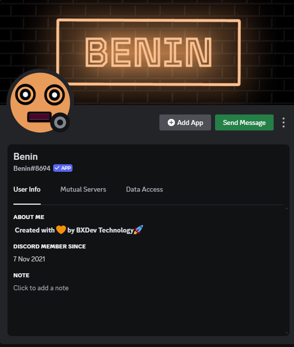
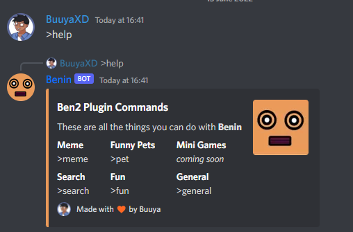
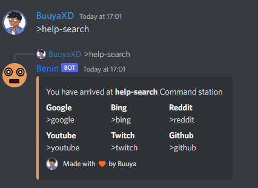
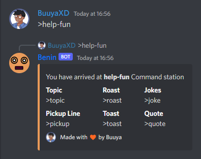

# 😂 BXDev Technology Meme Bot - Ben2 | Benin

<h4 align="center">Introducing BXDev's Benin (V2.0), where we bring the memes to your server! 😂</h4>

## Featured Project: Benin - Discord Bot

 

### What is Benin?

Benin is our flagship project, bringing memes and laughter to your Discord Server. Check out the code, contribute, and let's make Benin even more awesome together!

- **Repository**: [Benin Discord Bot](https://github.com/BXDevTech/Benin)

## Prefix  >> * <<

#### Deploy Ben2 using Heroku

Explore and deploy Ben2 effortlessly on Heroku. Click the link above to get started.

### Deployment using Heroku

1. **Sign Up on Heroku:**
   - If you don't have a Heroku account, start by signing up on [Heroku](https://www.heroku.com/).
   - It's a quick and easy process. Follow the on-screen instructions to create your account.

2. **Visit the Deployment Link:**
   - Once logged in, navigate to [this deployment link](https://www.heroku.com/).
   - This link will take you to Heroku's dashboard where you can manage your applications.

3. **Configure Your Discord Bot:**
   - Before deploying, make sure you have your Discord bot token and any required configurations ready.
   - Heroku uses environment variables to store sensitive information like tokens. You can set these in your Heroku app's settings.

4. **Deploy Your Bot:**
   - Follow Heroku's documentation to create a new app and deploy your Discord bot.
   - You can deploy your bot directly from your GitHub repository or by using Heroku CLI.

5. **Access and Manage Your Bot:**
   - Once deployed, you can access and manage your bot directly from your Heroku dashboard.
   - Make any necessary updates or changes to your bot's code by pushing changes to your linked GitHub repository.

6. **Enjoy Seamless Hosting:**
   - Heroku takes care of the hosting and maintenance of your Discord bot, allowing you to focus on enhancing its features and functionality.

Now, you're all set! Your Benin Discord bot is deployed, hosted, and ready to bring laughter to your server.

**Note:** If you encounter any issues or have questions during the deployment process, refer to Heroku's documentation or community support for assistance.

For more detailed instructions or troubleshooting, refer to the [Heroku Documentation](https://devcenter.heroku.com/). If you have any specific questions about Benin, join our [Support Server](https://discord.gg/SsW9HPKnUR) for assistance.

## Visual Preview

### Screenshot 1

### Screenshot 2

### Screenshot 3

### Screenshot 4

## Commands

- **help** : This commands shows you what commands this bot have
- **meme** : This one will show you random memes to make your day
- **pets** : This is will show you funny animals
- **games** : I just love delaying this one, i promise it will be a thing soon
- **search** : This one will search anything you want from discord
- **fun** : Just have fun with this one
- **general** : Just have fun with this one

## Links

- [GitHub Page](https://github.com/bxdevtech): Check out our open-source project.
- [Support Server](https://discord.gg/SsW9HPKnUR): Join our Discord community for assistance.

## Update Log - Version 2.5.7

- Added **Utility**
- Fixed **search**
- Updated all commands
- Minor embed changes
- Major bug fix

## Features

- 😂 High-quality file downloads
- 🔍 In-depth searching capabilities
- 🛠️ Extensive utility commands
- 🎲 Fun and interactive commands
- 🔄 Regular updates and improvements

## Getting Started

Ready to dive in? Follow these simple steps to get started:

1. **Clone the repository**: `git clone https://github.com/BXDevTech/Benin`
2. **Install Dependencies**: [Instructions on how to install dependencies]
3. **Build and Run**: [Instructions on how to build and run the project]

Need help or have questions? Reach out to us at [bxdevtech@gmail.com] - we're here for you!

## 🚀 Contribution Guidelines

We ❤️ contributions from the community! Whether you're a coding wizard or just starting, your input is valuable. Here's how you can get involved:

- **Fork the repository**
- **Create a new branch**: `git checkout -b feature/your-feature`
- **Make your changes and commit**: `git commit -m 'Add your feature'`
- **Push to the branch**: `git push origin feature/your-feature`
- **Open a pull request**

Let's build something amazing together!

## Code of Conduct: BXDev Technology Code of Conduct

Before you dive in, please review and adhere to our [Code of Conduct](CODE_OF_CONDUCT.md). We're all about creating a positive and inclusive community.

## License: BXDev Technology Proprietary License

Please review our [License](LICENSE) to understand how you can use and contribute to our projects.

🌟 Thank you for choosing BXDev Technology! Let's innovate, create, and build the future together. 🌟

